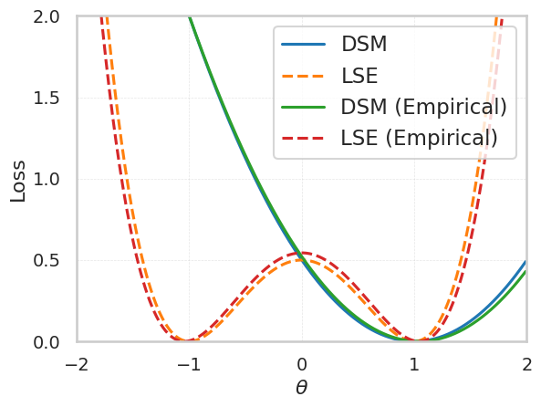
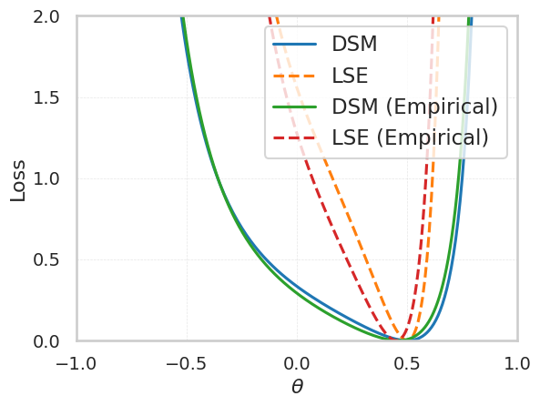

# Lifted Score Estimation Analysis

To understand the practical effect of lifting we study the underlying optimization landscape both theoretically via a closed form population objective and empirically via simulation.

First, consider a Gaussian distribution $p(\mathbf{x}) = \mathcal{N}(\mathbf{x}; \mathbf{0}, \Sigma)$ so that the underlying score is $\mathbf{s}(\mathbf{x}) = -\Sigma^{-1}\mathbf{x}$.  To reduce approximation error we assume a well specified score model $\mathbf{s}(\mathbf{x}; \theta) = -\Theta \mathbf{x}$.  Then the lifted score estimation objective is,

$$
    \mathcal{L}(\Theta) \triangleq \frac{1}{2} (\text{tr}(\Theta\mathbb{E}_{p(\mathbf{x})}[\mathbf{x}\mathbf{x}^\intercal]\Theta^\intercal))^2 - (\text{tr}(\Theta))^2.
$$

In the one dimensional setting this becomes

$$
    \mathcal{L}_{1D}(\theta)\triangleq \frac{1}{2} (\sigma^2\theta^2)^2 - \theta^2,
$$

where $\Sigma = \sigma$.  Both the population and empirical versions of this objective are plotted below. 

<p align="center">
  
</p>


Notice that the curvature of the DSM landscape is larger, while the LSE landscape appears sharper. As a result, after sign correction and with a good initialization, LSE might converge more quickly to the global minimum. However, due to the sharpness of the landscape, selecting an appropriate learning rate is crucial to prevent overshooting the minima. In this context, lifting helps to stabilize the solution, effectively resolving the minima in the underlying landscape.

The example can be made slightly more challenging by considering the two dimensional setting. We consider 

```math
\Sigma=\begin{bmatrix}
1 & \rho \\ 
\rho & 1
\end{bmatrix}
```

for some $\rho \in (-1,1)$. Since 

```math
\Sigma^{-1}=\frac{1}{1-\rho^2}\begin{bmatrix}
1 & -\rho \\ 
-\rho & 1
\end{bmatrix},
```
we set 

```math
\Theta=\frac{1}{1-\theta^2}\begin{bmatrix}1 & -\theta \\ -\theta & 1\end{bmatrix}.
```

Then, the LSE loss function becomes

```math
    \mathcal{L}_{2D}(\theta) \triangleq \frac{1}{2} \left(\frac{2}{(1-\theta^2)^2}(1-2\theta\rho+\theta^2)\right)^2 - \left(\frac{2}{1-\theta^2}\right)^2.
```

Note that the global optimizer is $\theta^\star=\rho$. Again, we plot both the population and empirical version of this objective below.  

<p align="center">
  
</p>

Lifting still induces a landscape with sharp curvature that could aid in accelerating convergence and resolving the solution.
